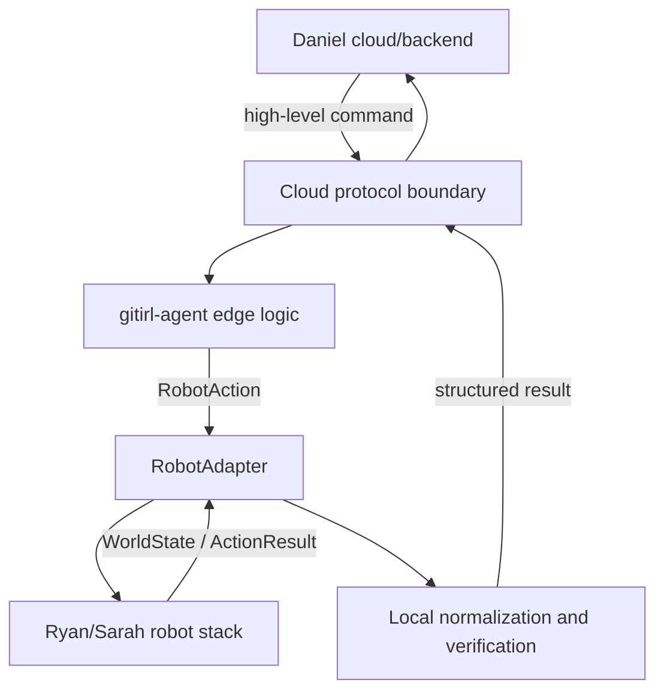

# Architecture

## Responsibility

`gitirl-agent` is the thin edge bridge between Daniel's cloud/backend and Ryan/Sarah's robot-side stack.



> **Do not move logic into gitirl-agent unless it benefits from being close to the robot or cleanly isolates cloud and robot interfaces.**

The edge owns command validation, stable internal types, robot-boundary translation, and local verification/retry when that is useful near the hardware. It does not own AWS, Supabase, Elastic, SMS, frontend, authentication, cloud persistence, general cloud orchestration, BracketBot internals, perception algorithms, manipulation logic, or low-level control.

## Stable internal contracts

- `GitIRLCommand`: normalized high-level command.
- `WorldState` / `ObjectState`: generic robot observation.
- `StateDiff`: current-versus-desired discrepancy.
- `RobotAction`: high-level robot request.
- `ActionResult`: normalized execution outcome.
- `RobotAdapter`: the only robot execution boundary.

Daniel's wire schema must not leak into planner, state, verification, or robot code. BracketBot APIs must not leak above `RobotAdapter`.

## Core path

```text
command
→ validate
→ desired/current state
→ deterministic diff
→ deterministic plan
→ RobotAdapter
→ fresh observation
→ verify
→ retry at most twice / return conflict or result
```

This is intentionally not an agent platform, workflow engine, or general task planner.

## Direct versus backend-routed robot calls

The current `RobotAdapter` is synchronous:

```python
observe() -> WorldState
execute(RobotAction) -> ActionResult
```

Keep it for mocks and a direct robot integration. If robot traffic must route through Daniel, the conceptual adapter remains useful, but its implementation or the orchestration call site may need to become asynchronous and correlate observations/results by `request_id`. Do not build that remote adapter until routing, acknowledgement, timeout, and retry semantics are confirmed.

## Hackathon disposition

| Area | Decision | Reason |
| --- | --- | --- |
| `orchestration/` | KEEP | Small restore/diff/commit integration path and bounded retry. |
| `planner/` | KEEP | Minimal deterministic `MOVED → MOVE_OBJECT` translation. |
| `state/` | KEEP | Shared cloud↔robot normalization and useful local fixtures. JSON storage is development-only. |
| `protocol/` | SIMPLIFY WHEN DANIEL'S CONTRACT ARRIVES | Useful isolation boundary; current event set is provisional. |
| `transport/` | KEEP | Small replaceable WebSocket client; do not expand before the contract. |
| `media/` | DEFER | Useful experiment, but likely belongs directly between robot and cloud. Do not integrate further yet. |

Nothing currently warrants removal: the questionable pieces are isolated and do not complicate the core path unless the team chooses to use them.
