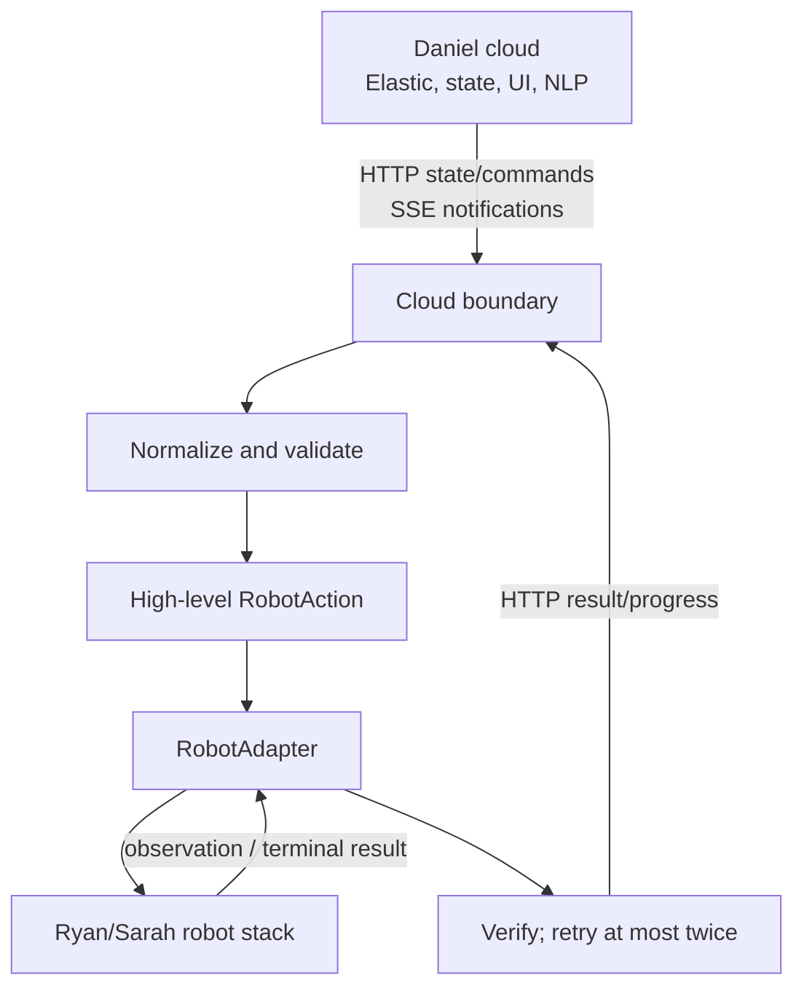

# Architecture

## Responsibility

`gitirl-agent` is a thin edge bridge:



**Do not move logic into gitirl-agent unless it benefits from being close to the robot or cleanly isolates cloud and robot interfaces.**

It does not own AWS, Supabase, Elastic, SMS, frontend, authentication, cloud persistence/NLP/orchestration, BracketBot internals, perception, manipulation, VLA logic, or motor control.

## Boundaries

Daniel-specific JSON is isolated to:

- `protocol/daniel.py`: Daniel state/job payloads → internal types.
- `transport/daniel_api.py`: HTTP requests and SSE subscription.

Robot-specific behavior is isolated to:

- `robot/interface.py`: stable `observe` / `execute` contract.
- `robot/http_adapter.py`: edge → robot HTTP client.
- `robot/http_server.py`: small server template for Ryan/Sarah's backend.
- `robot/bracketbot.py`: confirmed, read-only BBOS observations and unfinished integration seams.

Planner, diff, verification, and orchestration know neither Daniel's wire schema nor BBOS.

## Data path

Daniel's current `/api/state` object pose is normalized as:

```json
{
  "object_id": "mug_a1b2",
  "position": {"x": 0.42, "y": 0.18, "z": 0.76},
  "orientation": {"yaw": 15.0},
  "metadata": {
    "coordinate_frame": "canonical_world_z_up",
    "position_unit": "m",
    "yaw_unit": "deg"
  }
}
```

Daniel's confirmed canonical frame is +X forward from the anchor, +Y left, +Z up. Robot code must explicitly transform this to its required frame; the edge never swaps axes or units implicitly.

A confirmed Daniel job `moved` op becomes one `MOVE_OBJECT` with source and target `ObjectState`. Other operation types remain unsupported/conflicts until robot behavior exists.

## Why HTTP + SSE

- HTTP is request/response, easy to inspect with `curl`, naturally handles terminal action results, and avoids connection state.
- SSE is appropriate only for Daniel→edge notifications: ordered text events, built-in event IDs, simple reconnect/replay.
- Robot actions remain HTTP because they need explicit acknowledgement, timeout, and terminal result.
- Camera frames remain ordinary HTTP POSTs if the team keeps this path; video/media should not be put on SSE.

Daniel's current SSE `job` event is only a summary and does not contain executable `ops`. No robot action can safely be triggered from it yet. Daniel must include the full job or provide a `GET job by id` endpoint plus an authenticated result endpoint.

## Confirmed robot facts

BBOS is local shared-memory IPC. Confirmed read topics include the head/left/right JPEG streams, camera status, and arm state. Control/torque topics are single-writer and are not opened here.

Sarah's current `precision_placement.py` is a local CLI for saved joint-pose replay. It has no JSON object-command/result contract and is not called by the edge.

## Keep simple

| Area | Decision |
| --- | --- |
| state/diff/planner/orchestration | Keep for mocks, deterministic restore, and verification. |
| protocol/transport | Keep small; this is the cloud isolation seam. |
| RobotAdapter | Keep; direct or HTTP implementations can change without changing core types. |
| deterministic NLP | Keep as local fallback only. |
| camera streaming | Deferred; do not expand tonight. |
| agent frameworks/LLMs/vector DBs | Cloud-owned or out of scope here. |
