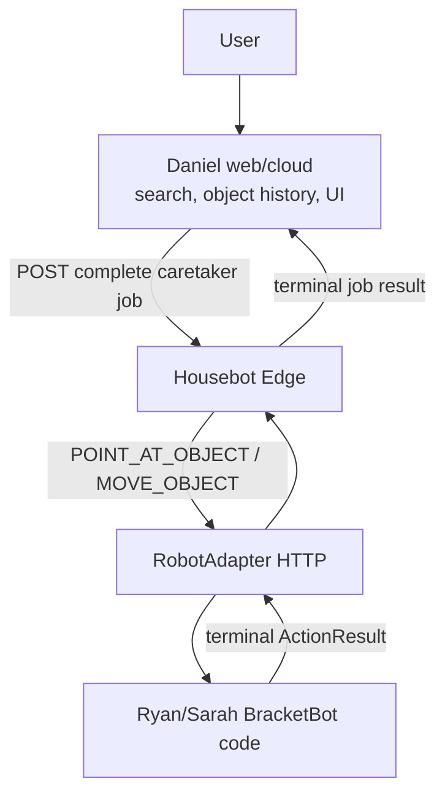

# Housebot architecture

## MVP

Daniel's current backend already searches objects and produces a complete `point` job, but labels it `executor: not_connected`. Housebot Edge fills that executor gap.

## Responsibilities

Daniel owns UI, Elastic search, object history, cloud data, authentication, and any NLP. Ryan/Sarah own perception, world-to-robot transforms, manipulation, BBOS writer safety, and terminal robot results.

Andrew's edge owns only:

- strict cloud-job validation and translation;
- one-at-a-time robot execution;
- job correlation and process-local duplicate suppression;
- normalized results and end-to-end testing.

## Transport

- Daniel → edge: ordinary HTTP `POST /v1/jobs`.
- Edge → robot: ordinary HTTP `POST /v1/actions` and `GET /v1/observation`.
- SSE remains useful for browser status display, but it is not needed in the physical command path.
- Camera and high-rate telemetry are out of the caretaker MVP path.

This can run across three laptops/hosts on the same LAN. AWS cannot normally initiate a connection to a private laptop or robot. If Daniel deploys the command producer to AWS, either keep a small LAN-side Daniel process or later add outbound edge polling; do not add a public tunnel to the physical control loop unless the team accepts that risk.

## Safety properties

- Unsupported or malformed jobs never reach `RobotAdapter`.
- One lock serializes physical jobs.
- A completed `job_id` is not executed twice while the edge process remains alive.
- A robot API timeout is treated as ambiguous failure, not blindly retried.
- The edge does not transform axes or units implicitly.

Durable idempotency, authentication policy, cancellation, and restart reconciliation remain Daniel-contract work.

## Legacy GitIRL modules

The deterministic GitIRL parser, state store, diff planner, and restore orchestrator remain available for tests or a later “save this setup / restore this setup” feature. They are not on the caretaker MVP critical path and should not be expanded tonight.
